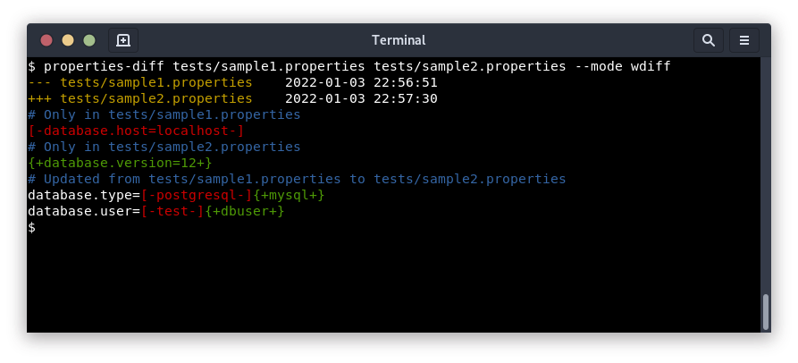
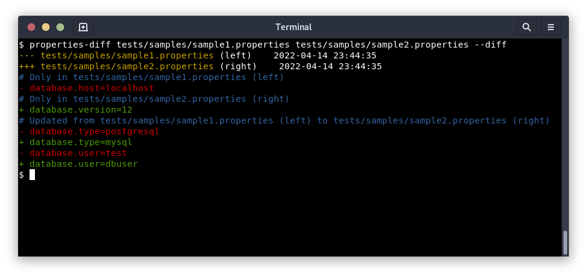
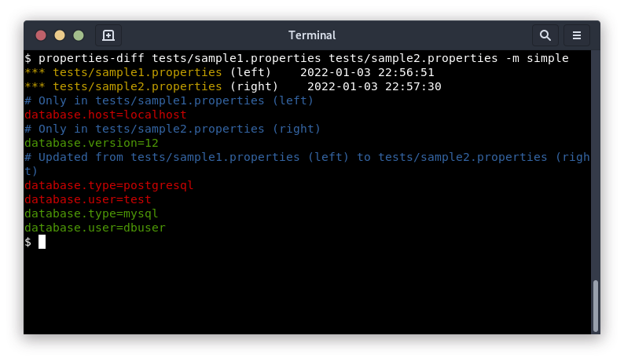

# properties-tools

**properties-tools** is a collection of command line tools to work with *properties* files: comparing like `wdiff`, updating like `patch`... 

The idea is to work with the *content* (`key/value` pairs) instead of the *text*, to ignore order or format and deal with the data.


* [`properties-diff`](#properties-diff) can compare and print differences between 2 *properties* files, with fancy colors as if you were using `wdiff` or `diff` tools. It does not compare the *text* files.
* [`properties-patch`](#properties-patch) can update a *properties* file using values from others, you can choose to *add* new keys and/or *update* existing and/or *remove* others.


# Install

Install the latest release from [PyPI](https://pypi.org/project/properties-tools/)
```sh
$ pip3 install properties-diff
$ properties-diff --help
```

Install from the sources
```sh
$ pip3 install --user --upgrade git+https://github.com/essembeh/properties-tools
$ properties-diff --help
```


# properties-diff


## Usage

```sh
$ properties-diff --help
usage: properties-diff [-h] [-q] [--quote] [--sep SEP] [-m {simple,diff,wdiff}] [-A] [-D] [-U] left.properties right.properties

positional arguments:
  left.properties       left file to compare
  right.properties      right file to compare

optional arguments:
  -h, --help            show this help message and exit
  -q, --quiet           print less information
  --quote               use double quotes for values, example: foo="bar"
  --sep SEP             key/value separator, default is '='
  -m {simple,diff,wdiff}, --mode {simple,diff,wdiff}
                        select a format to show differences: using colors only (simple), using diff-like format (diff) or wdiff-like (wdiff) format. Default is 'wdiff'
  -A, --added           print added properties
  -D, --deleted         print deleted properties
  -U, --updated         print updated properties
```


## Examples

Comparing *properties* files like `wdiff`
```sh
$ properties-diff tests/sample1.properties tests/sample2.properties
--- tests/sample1.properties (left)    2022-04-07 12:48:44
+++ tests/sample2.properties (right)    2022-04-07 12:49:02
# Only in tests/sample1.properties (left)
[-database.host=localhost-]
# Only in tests/sample2.properties (right)
{+database.version=12+}
# Updated from tests/sample1.properties (left) to tests/sample2.properties (right)
database.type=[-postgresql-]{+mysql+}
database.user=[-test-]{+dbuser+}
```

Comparing *properties* files like `diff`
```sh
$ properties-diff tests/sample1.properties tests/sample2.properties --mode diff
--- tests/sample1.properties (left)    2022-04-07 12:48:44
+++ tests/sample2.properties (right)    2022-04-07 12:49:02
# Only in tests/sample1.properties (left)
- database.host=localhost
# Only in tests/sample2.properties (right)
+ database.version=12
# Updated from tests/sample1.properties (left) to tests/sample2.properties (right)
- database.type=postgresql
+ database.type=mysql
- database.user=test
+ database.user=dbuser
```

Compare files, but only show `updateed` and `added` values
```sh
$ properties-diff tests/sample1.properties tests/sample2.properties --add --update
--- tests/sample1.properties (left)    2022-04-07 12:48:44
+++ tests/sample2.properties (right)    2022-04-07 12:49:02
# Only in tests/sample2.properties (right)
{+database.version=12+}
# Updated from tests/sample1.properties (left) to tests/sample2.properties (right)
database.type=[-postgresql-]{+mysql+}
database.user=[-test-]{+dbuser+}
```


## Viewing modes

You can see *differences* between the *properties* files using 3 modes using `--mode <MODE>` or `-m <MODE>`
* `wdiff`, prints the changes like `wdiff` tool would do (this is the default mode)
* `diff`, prints the changes like `diff` tool would do
* `simple`, based on colors, *red* for removed lines, *green* for added lines






# properties-patch


## Usage

```sh
$ properties-patch --help
usage: properties-patch [-h] [-c] [--comments] [-f] [-i] [--quote] [--sep SEP] [-A] [-D] [-U] -p patch.properties [-o output.properties] source.properties

positional arguments:
  source.properties     file to modify

optional arguments:
  -h, --help            show this help message and exit
  -c, --color           print colors
  --comments            insert comment when property is added, updated or deleted
  -f, --force           force output file (--output) overwrite if it already exists
  -i, --interactive     ask for confirmation to add, update or delete a property
  --quote               use double quotes for values, example: foo="bar"
  --sep SEP             key/value separator, default is '='
  -p patch.properties, --patch patch.properties
                        patch file
  -o output.properties, --output output.properties
                        modified file

  -A, --add             add new properties from patches
  -D, --delete          delete properties not in patches
  -U, --update          update properties from patches
```


## Examples

Build a properties file from `tests/sample1.properties` and add missing keys from  `tests/sample2.properties` 
```sh
$ properties-patch tests/sample1.properties --patch tests/sample2.properties --add     
# just a comment
database.type=postgresql
database.host=localhost
database.port=5432
# and another comment
database.user=test
database.password=foobar
database.version=12
```

You can use multiple *patch* files, if a value is present in multiple *patch* files, the latest value will be used. 
```sh
$ properties-patch tests/sample1.properties --patch tests/sample2.properties --patch tests/sample3.properties -A    
# just a comment
database.type=postgresql
database.host=localhost
database.port=5432
# and another comment
database.user=test
database.password=foobar
database.version=42
```

You can choose to *add* missing values and *update* values that are different in the *patch* files
```sh
$ properties-patch tests/sample1.properties --patch tests/sample2.properties -AU
# just a comment
database.type=mysql
database.host=localhost
database.port=5432
# and another comment
database.user=dbuser
database.password=foobar
database.version=12
```

There is an *interactive* mode, which ask for confirmation before every change (usefull to take only some changes, equivalent to `git add --interactive`)
```sh
$ properties-patch tests/sample1.properties --patch tests/sample2.properties -AU --interactive
# just a comment
💬  Update database.type=postgresql,mysql ? [Y/n] 
database.type=mysql
database.host=localhost
database.port=5432
# and another comment
💬  Update database.user=test,dbuser ? [Y/n] 
database.user=dbuser
database.password=foobar
💬  Add database.version=12 ? [Y/n] 
database.version=12
```

To track changes, you can add comments for every change applied
```sh
$ properties-patch tests/sample1.properties --patch tests/sample2.properties -ADU --comments
# just a comment
# 2022-04-07 23:12:11  update: database.type=postgresql
database.type=mysql
# 2022-04-07 23:12:11  remove: database.host=localhost
database.port=5432
# and another comment
# 2022-04-07 23:12:11  update: database.user=test
database.user=dbuser
database.password=foobar
# 2022-04-07 23:12:11  add: database.version
database.version=12
```