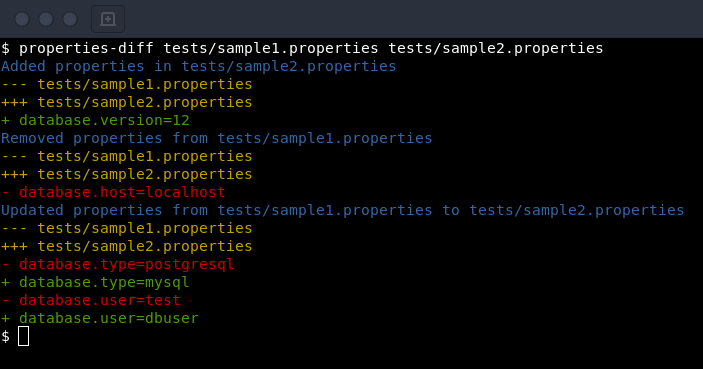

# properties-diff

Command line tool to compare *properties* files and print differences with colors as if you were using `diff` or `colordiff` tools.




# Install

Install from the sources
```sh
$ pip3 install --user --upgrade git+https://github.com/essembeh/properties-diff
$ properties-diff path/to/file.properties path/to/another/file.properties
```

Install the latest release from [PyPI](https://pypi.org/project/properties-diff/)
```sh
$ pip3 install --user --upgrade properties-diff
$ properties-diff path/to/file.properties path/to/another/file.properties
```
